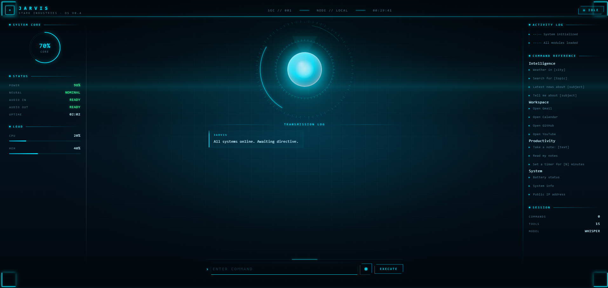

# JARVIS

An autonomous AI assistant with voice I/O, tool calling, code execution, browser automation, multi-agent orchestration, and self-extension — JARVIS writes its own tools.

Built in Python, JARVIS combines a Groq-powered LLM brain with a growing toolset (55+ built-in, unlimited learned), persistent memory, autonomous experiment mode, and a Stark Industries-style web HUD.



---

## Table of Contents

- [Features](#features)
- [Architecture](#architecture)
- [Project Structure](#project-structure)
- [Installation](#installation)
- [Usage](#usage)
- [Experiment Mode](#experiment-mode)
- [Self-Extension in Action](#self-extension-in-action)
- [Memory System](#memory-system)
- [Tools Reference](#tools-reference)
- [Multi-Agent Orchestration](#multi-agent-orchestration)
- [Anticipation Engine](#anticipation-engine)
- [Tool Router](#tool-router)
- [Recovery Layer](#recovery-layer)
- [Known Limitations](#known-limitations)
- [Dependencies](#dependencies)
- [Contributing](#contributing)
- [License](#license)
- [Acknowledgements](#acknowledgements)

---

## Features

### Interfaces

- **Terminal** (`jarvis.py`) — type or speak
- **Web UI** (`app.py`) — Stark Industries-style HUD with an animated arc reactor, live telemetry, streaming transcript, and gold-bordered plan rendering

### Voice I/O

- Speech-to-text via **Whisper** (`base` model), auto language detection (English + Hindi)
- Text-to-speech via **edge-tts** (Microsoft neural voice)
- Hybrid input — type commands or use voice
- Wake word detection (optional) — say "Hey Jarvis"

### LLM Brain

- **Groq API** (free tier) with multi-model fallback: `openai/gpt-oss-120b` → `openai/gpt-oss-20b` → `qwen/qwen3.8-27b`
- **Ollama** local fallback (`qwen2.5:3b`) for offline use
- Streaming responses (token-by-token)
- Autonomous planning — LLM writes a `PLAN:` block for multi-step tasks
- Up to 8 tool calls per request (loop-protected)
- Tool hallucination guard — rejects invalid tool names and retries
- JSON retry handling for malformed tool calls
- Groq channel-suffix normalization (strips `.channel` / `commentary` artifacts)
- Narration detection — catches LLMs that describe tool calls in text instead of emitting them
- Automatic `TOOLS` reload after `create_tool` succeeds, so new tools are usable in the same session

### Self-Extension — JARVIS Writes Its Own Tools

This is the headline feature. When you ask JARVIS for something none of its 55+ built-in tools can do, it:

1. **Recognizes the gap** — the LLM checks the tool list, finds no match
2. **Writes new Python code** for the tool
3. **Tests it** in a subprocess sandbox
4. **Retries with correction** if the test fails or the JSON is malformed
5. **Saves it permanently** to `tools_learned/`
6. **Auto-loads it** on every restart, and reloads it mid-session after successful creation

**Example:**

```text
You: build a tool that reads a text file and returns the 10 most common words
JARVIS:
  [Calling create_tool...]
  [self-ext] Testing new tool: top_words...
  [self-ext] Test PASSED for top_words
  [self-ext] SAVED: tools_learned/top_words.py
  New tool 'top_words' created and saved.
```

Later:

```text
You: what are the most common words in test.txt
JARVIS: [Calling top_words...]
        Top words: the (5), quick (2), brown (2), fox (2), jumps (1)...
```

The tool is permanent. No code writing needed the second time.

**Safety:**

- Every new tool must pass a test before being saved
- Blocked imports: `os.system`, `subprocess`, `socket`, `eval`, `exec`, `shutil.rmtree`, `requests.post`
- Function name must match the tool name
- Manual review via `/learned <name>`
- Manual delete via `/forget-tool <name>`
- Everything stays local — nothing uploaded

### Experiment Mode

A different way to use JARVIS. Instead of answering a research question, it designs and runs a reproducible experiment.

**Pipeline:** QUESTION → HYPOTHESIS → DESIGN → EXECUTE → ANALYZE → CONCLUDE

**Example:**

```text
You: investigate whether more training data improves accuracy

JARVIS:
  Experiment Mode — EXP-A1B2C3
  Hypothesis -> Increasing training set size improves validation accuracy
  Execution -> running
  Analysis -> complete

  Observed: Accuracy rose from 0.61 (20% data) to 0.89 (100% data),
  with the largest gain between 20% and 60%.

  Conclusion: Yes, more data helps, but with sharply diminishing
  returns after 60%.

  Artifacts: experiments/EXP-A1B2C3
```

Each experiment is saved to `experiments/<id>/` with:

- `experiment.json` — hypothesis, variables, code spec
- `experiment.py` — the runnable script
- `results.json` — structured results
- `report.md` — full markdown report
- `plots/` — any matplotlib figures

Bounded to 2 LLM calls per experiment (1 planning + 1 analysis), plus one optional follow-up if the result is inconclusive. All execution is deterministic Python.

**Reproducible:** rerun any experiment by running `python experiment.py` in its folder.

### Anticipation Engine

Learns query patterns and precomputes likely answers during idle time.

- Runs on Ollama (zero cloud tokens)
- Requires 3+ observations before acting on a pattern
- Idle-triggered (15 min of no input) + startup catch-up if offline >24h
- Cache TTL per tool (weather = 1h, calculator = infinite, current_time = 0)
- Exposed under `/api/anticipate-stats`

### Tool Router

Lightweight keyword-based router that picks relevant tools per request.

- Core tools always sent (weather, search, code, memory)
- Category-based selection adds tools when keywords match
- Falls back to full set when uncertain (`load_all_tools` meta-tool)
- Saves ~2,500 tokens/request on average

### 55+ Built-in Tools Across 12 Categories

| Category | Tools |
|----------|-------|
| Intelligence | Weather, Wikipedia, random Wikipedia, web search, news search |
| Workspace | Send email, open apps (Spotify, Chrome, VS Code, etc.), open websites |
| Productivity | Screenshot, clipboard read/write, file search, notes, timer, reminders |
| System | System info (battery, CPU, RAM), public IP |
| Entertainment | YouTube playback (yt-dlp + mpv), Spotify web player |
| Utility | Calculator, coin flip, dice roll, morning briefing |
| Conversion | Unit conversion (length, weight, temperature), currency (live rates) |
| Language | Translation (30+ languages), PDF text extraction |
| Code execution | Sandboxed Python — computes, analyzes CSV/JSON, plots data |
| Screen vision | Analyze screen, read screen text, explain screen errors, translate screen |
| RAG over files | Index a folder once, then ask questions about your PDFs/notes |
| Browser automation | Playwright — open URLs, search Google/YouTube, click, type, scrape |
| Multi-agent | Spawn parallel sub-agents (researcher, coder, writer, planner) |
| Scheduling | `schedule_task`, `watch_for` — recurring tasks and condition watchers |
| Self-extension | `create_tool` — write new tools at runtime |

### Long-term Memory

- Persistent **SQLite** store for user facts ("remember X")
- Full conversation history — searchable, queryable by date
- Session memory for "repeat that" / "what did I just ask"
- Slash commands: `/remember`, `/memory`, `/forget`, `/history`, `/stats`

### Ambient Context

Tracks what you're doing (active app, window title, idle time, battery, git status, recent files) so responses can be context-aware. Injected only when the query needs it, keeping requests lean.

### Recovery Layer

Every tool call is classified on failure:

- **Rate limit** → move to next model
- **Tool validation failure** → retry same model with a correction prompt
- **JSON parse error** → retry with a shorter-code instruction
- **Narration/loop** → retry with an anti-narration correction

### Slash Commands + Shell Features

- `/w [city]` → weather | `/s [query]` → search | `/p [song]` → play | `/stop` → stop music
- `/t [text] to [lang]` → translate | `/wiki [topic]` → Wikipedia | `/c [expr]` → calculate
- `/note` | `/remind` | `/screen` | `/read` | `/error` | `/index` | `/ask` | `/clear` | `/help`
- `/tools` — list all learned tools
- `/learned [name]` — show the source code of a learned tool
- `/forget-tool [name]` — delete a learned tool
- Command history (Up/Down arrow keys)
- Tab completion for common commands

---

## Architecture

```text
USER INPUT (voice / typed text / wake word)
        |
        v
   voice.py  --- Whisper ---> text
        |
        v
   jarvis.py  --- think_stream()
        |
        v
   brain.py
        |
        +-- Anticipation cache check (anticipate.py)
        |
        +-- Tool selection (tool_router.py)
        |
        +-- LLM call (Groq multi-model + Ollama fallback)
        |
        v
   Recovery + narration detection
        |
        +-- If tool calls -> execute_tool()
        |       |
        |       +-- tools.py, search.py, productivity.py
        |       +-- advanced.py, screen_vision.py, document_rag.py
        |       +-- code_runner.py, browser_control.py
        |       +-- agents.py, memory.py
        |       +-- self_extension.py ---> tools_learned/*.py
        |       +-- experiment.py
        |       +-- anticipate.py
        |       |
        |       +-- Loop protection + tool-name repeat check
        |
        +-- If no tool calls -> stream content
        |
        v
   Output
        +-- Streaming text to terminal/HUD
        +-- voice.py --- edge-tts ---> speech
        +-- Web HUD (Flask + SSE)
```

The pipeline flows through seven stages:

1. **Input** — microphone, typed text, or wake word.
2. **Voice** — Whisper converts speech to text; edge-tts converts text to speech.
3. **Brain** — Groq multi-model LLM handles streaming, fallback, planning, and recovery. Ollama runs as a local fallback.
4. **Router** — `think_stream()` and `execute_tool()` in `jarvis.py` orchestrate the flow.
5. **Tools** — twelve tool modules covering intelligence, productivity, code execution, vision, RAG, browser automation, multi-agent orchestration, memory, experiments, and self-extension.
6. **Learned tools** — `self_extension.py` writes new tools at runtime; they persist in `tools_learned/` and reload automatically.
7. **Output** — streaming text to the terminal, spoken response via TTS, and the web HUD.

---

## Project Structure

```text
jarvis/
├── app.py                 # Flask web server — Stark HUD interface
├── jarvis.py              # Main terminal entry point & router
├── brain.py               # LLM brain: Groq calls, streaming, recovery
├── voice.py               # Speech-to-text & text-to-speech
├── wake_word.py           # Vosk wake word detection
├── wake_listener.py       # Wake word listener with browser polling
├── input_handler.py       # Hybrid input handling
├── tools.py               # Core tool registry & dispatcher
├── search.py              # Web search, news, Wikipedia, weather
├── productivity.py        # Screenshot, clipboard, notes, timer, reminders
├── advanced.py            # Unit conversion, currency, translation, PDF
├── screen_vision.py       # Screen analysis
├── document_rag.py        # RAG over local PDFs / notes
├── code_runner.py         # Sandboxed Python execution
├── browser_control.py     # Playwright browser automation
├── agents.py              # Multi-agent orchestration
├── memory.py              # SQLite long-term memory & conversation history
├── self_extension.py      # Self-extending agent — writes new tools
├── experiment.py          # Experiment Mode: hypothesis -> run -> analyze
├── anticipate.py          # Anticipation engine: predicts frequent queries
├── tool_router.py         # Keyword-based tool selection
├── tool_stats.py          # Tracks per-tool call/success rates
├── lessons.py             # Stores lessons learned from failures
├── recovery.py            # Error classification & correction prompts
├── ambient.py             # Ambient context tracker (app, idle, battery)
├── daemon.py              # Background daemon (notifications, watchers)
├── tasks.py               # Scheduled tasks & watchers
├── notifications.py       # Browser notification queue
├── slash_commands.py      # Slash command handling
├── youtube_player.py      # YouTube playback via yt-dlp + mpv
├── claude_tools.py        # Tool schemas (auto-loads tools_learned/)
├── check.py               # Health check diagnostic script
├── tools_learned/         # Learned tools (auto-generated)
├── templates/             # HTML templates for the web HUD
├── static/                # CSS + JS for the HUD
├── docs/                  # Documentation & screenshots
├── requirements.txt       # Python dependencies
└── README.md
```

---

## Installation

### Prerequisites

- Python 3.10+
- **Groq API key** (free tier at [console.groq.com](https://console.groq.com))
- Optional: **Ollama** for local LLM fallback
- Optional: **Playwright** browsers for browser automation
- Optional: **Vosk** model for wake word detection

### Steps

1. **Clone the repository**

   ```bash
   git clone https://github.com/Happ3ns/jarvis.git
   cd jarvis
   ```

2. **Create and activate a virtual environment**

   ```bash
   python -m venv venv
   source venv/bin/activate   # Linux / macOS
   venv\Scripts\activate      # Windows
   ```

3. **Install Python dependencies**

   ```bash
   pip install -r requirements.txt
   ```

4. **Install Playwright browsers**

   ```bash
   playwright install
   ```

5. **Set up environment variables**

   Create a `.env` file in the project root:

   ```env
   GROQ_API_KEY=your_groq_api_key_here
   # Optional
   OLLAMA_BASE_URL=http://localhost:11434
   SPOTIFY_CLIENT_ID=your_spotify_client_id
   SPOTIFY_CLIENT_SECRET=your_spotify_client_secret
   ```

6. **Download the Vosk model** (if using wake word)

   ```bash
   wget https://alphacephei.com/vosk/models/vosk-model-small-en-us-0.15.zip
   unzip vosk-model-small-en-us-0.15.zip -d models/
   ```

7. **Run the health check**

   ```bash
   python check.py
   ```

   Verifies all modules import, tool schemas are valid, and secrets are properly gitignored.

---

## Usage

### Terminal Mode

```bash
python jarvis.py
```

- Type commands or press `v` to speak.
- Say "Hey Jarvis" (if wake word enabled).
- Use slash commands for quick actions.

### Web HUD

```bash
python app.py
```

Open `http://localhost:5000`.

### Example Commands

```text
"What's the weather in Tokyo?"
"Search for the latest AI news"
"Play Bohemian Rhapsody on YouTube"
"Translate 'Good morning' to Spanish"
"Take a screenshot and read the text"
"Analyze this CSV file: /path/to/data.csv"
"Remember that my favorite color is blue"
"/index /home/user/documents"
"/ask What are the key points in my notes?"
"Spawn a researcher and a writer to create a report on quantum computing"
"build a tool that generates a QR code for any URL"
"investigate whether more training data improves accuracy"
```

---

## Experiment Mode

JARVIS can run reproducible experiments when you ask it to test a claim.

### How it works

1. **Plan** — one LLM call converts your question into a strict JSON spec (hypothesis, variables, controls, trials, metric, code)
2. **Execute** — the generated Python script runs in a sandbox. Deterministic. No LLM involved.
3. **Analyze** — one LLM call interprets the compact results JSON
4. **Follow-up** — optional, at most one, if the result is inconclusive

Two LLM calls in the normal case. Four maximum if a follow-up runs.

### What gets saved

```text
experiments/<id>/
├── experiment.json     # Full spec + code
├── experiment.py       # Runnable script
├── results.json        # Structured results + metadata
├── report.md           # Full markdown report
└── plots/              # Matplotlib figures
```

### Reproducibility

Every experiment records:

- Random seed
- Dataset source (synthetic if none provided)
- Model architecture and hyperparameters
- Metrics
- Execution time
- Python version

To rerun: `cd experiments/<id> && python experiment.py`.

---

## Self-Extension in Action

### Example 1 — Word frequency counter

```text
You: build a tool that reads a text file and returns the 10 most common words
JARVIS:
  [Calling create_tool...]
  [self-ext] Testing new tool: top_words...
  [self-ext] Test PASSED for top_words
  [self-ext] SAVED: tools_learned/top_words.py
  Tool 'top_words' created and saved.
```

Then:

```text
You: what are the most common words in test.txt
JARVIS: [Calling top_words...]
        the (5), quick (2), brown (2), fox (2)...
```

### Example 2 — CSV merger

```text
You: build a tool that reads a folder of CSVs, merges them all into one
JARVIS:
  [Calling create_tool...]
  Tool created: merge_csv_folder
  This tool reads all .csv files in a folder, concatenates them vertically,
  and saves the merged DataFrame to merged.csv.
```

### Managing learned tools

| Command | What it does |
|---|---|
| `/tools` | Lists every tool JARVIS has written |
| `/learned top_words` | Shows the source code |
| `/forget-tool top_words` | Deletes it permanently |

### Where the tools live

```text
tools_learned/
├── top_words.py
├── top_words.schema.json
├── merge_csv_folder.py
└── merge_csv_folder.schema.json
```

Each `.py` is the implementation. Each `.schema.json` is the OpenAI-format schema the LLM sees. On startup, `claude_tools.py` scans this folder and appends every schema to `TOOLS`.

---

## Memory System

JARVIS stores long-term memory in a local SQLite database (`memory.db`).

- **Facts** — use `/remember` to persist user facts; retrieve with `/memory`.
- **Conversation history** — every session is logged and searchable by date.
- **Session memory** — in-context recall for "repeat that" or "what did I just ask".

Slash commands:

- `/remember <fact>` — store a fact
- `/memory` — list stored facts
- `/forget <fact>` — remove a fact
- `/history` — show recent conversation history
- `/stats` — show memory statistics

---

## Tools Reference

| Module | Description |
|--------|-------------|
| `tools.py` | Central registry and dispatcher |
| `search.py` | Web search, news, Wikipedia, weather |
| `productivity.py` | Screenshot, clipboard, file search, notes, timer |
| `advanced.py` | Unit conversion, currency, translation, PDF |
| `screen_vision.py` | Screen analysis using Qwen vision model |
| `document_rag.py` | RAG over local PDFs and notes |
| `code_runner.py` | Sandboxed Python execution |
| `browser_control.py` | Playwright automation with persistent profile |
| `agents.py` | Parallel sub-agents |
| `memory.py` | SQLite long-term memory |
| `self_extension.py` | Write new tools at runtime |
| `experiment.py` | Experiment Mode: design, run, analyze |
| `anticipate.py` | Anticipation engine |
| `youtube_player.py` | YouTube playback via yt-dlp + mpv |

---

## Multi-Agent Orchestration

JARVIS can spawn parallel sub-agents:

- **Researcher** — gathers information from the web and local files.
- **Coder** — writes and executes code in a sandbox.
- **Writer** — composes reports, summaries, and creative content.
- **Planner** — breaks down large goals into actionable steps.

Example:

> "Spawn a researcher and a writer to create a report on the latest advances in fusion energy."

---

## Anticipation Engine

Learns query patterns and precomputes frequent queries ahead of time.

### How it works

1. Every query is logged with its hour, weekday, and the tools it used
2. When idle for 15 minutes, the engine scans for patterns seen 3+ times
3. For patterns whose hour matches now or next hour, it runs the tool directly (no LLM)
4. The result is cached with a TTL
5. Next time you ask the same question, the cache serves it in <100ms for zero tokens

### Configuration

- `MIN_OBSERVATIONS = 3` — patterns must repeat 3 times before acting
- `CACHE_TTL_SECONDS = 3600` — default cache lifetime
- `CONSOLIDATION_INTERVAL = 900` — minimum seconds between consolidation runs
- `IDLE_THRESHOLD = 900` — seconds of idle before consolidation triggers

### Storage

`anticipate.db` — three tables: `queries`, `cache`, `meta`.

---

## Tool Router

Keyword-based tool selection to reduce per-request token cost.

- Core tools always included: `run_code`, `compute`, `get_weather`, `search_web`, `open_url`, `remember_fact`, `recall_facts`, `create_tool`, experiment tools, `get_time`, `get_date`
- Category-based: 10 categories (music, vision, browser, files, memory, productivity, apps, system, agents, utility) with keyword triggers
- If nothing matches, falls back to productivity + files categories
- A `load_all_tools` meta-tool is always sent for cases the router can't anticipate

Savings: ~2,500 tokens/request. Reliability tradeoff: occasional misses when keywords don't match. Mitigation: `load_all_tools` allows the LLM to expand the set on demand.

---

## Recovery Layer

Central classifier for tool-call and API failures.

| Category | Action |
|---|---|
| `rate_limit` | Move to next model in `MODELS` |
| `tool_validation` | Retry same model with correction message |
| `json_parse` | Retry with "shorter code" instruction |
| `narration` | Retry with anti-narration correction (once) |
| `network` | Move to next model |
| `unknown` | Move to next model |

Defined in `recovery.py`. Correction prompts are stored in a `CORRECTIONS` dict keyed by category.

---

## Known Limitations

- **Groq free tier** is limited to ~8,000 tokens/minute per model. A full JARVIS request (55+ tool schemas + system prompt + context) consumes ~7,500 tokens, so the free tier allows roughly one request per minute. Ollama runs as a fallback with no rate limits, but with lower quality on complex tool-calling tasks.
- **Small local models** (1B–3B) cannot reliably produce structured tool calls. Tool creation specifically requires `gpt-oss-120b` (Groq) or a 7B+ local model.
- **Browser automation** uses Playwright's persistent profile in `.browser_profile/`. Logins must be done once, manually. The folder is gitignored — never committed.
- **Sandbox** is keyword-based (blocks `os.system`, `subprocess`, etc.) and not a full security boundary. Suitable for personal use, not public deployment.
- **Experiment Mode** uses synthetic data when no dataset is provided. Real experiments on real data require passing a dataset path.

---

## Dependencies

Core dependencies (see `requirements.txt`):

- `sounddevice`, `numpy` — audio capture
- `openai-whisper` — speech-to-text
- `edge-tts` — text-to-speech
- `ddgs` — web search
- `requests` — HTTP client
- `spotipy` — Spotify integration
- `psutil` — system info
- `flask` — web HUD
- `pyperclip`, `pyautogui` — clipboard and screen automation
- `openai` — Groq + Ollama API client
- `vosk` — wake word detection
- `playwright` — browser automation
- `chromadb`, `sentence-transformers` — RAG embeddings
- `yt-dlp`, `mpv` — YouTube playback
- `matplotlib` — experiment plots

---

## Contributing

1. Fork the repository.
2. Create a feature branch (`git checkout -b feature/amazing-feature`).
3. Commit your changes (`git commit -m 'Add amazing feature'`).
4. Push to the branch (`git push origin feature/amazing-feature`).
5. Open a Pull Request.

---

## License

MIT License — use, modify, and extend freely. See [LICENSE](LICENSE) for details.

---

## Acknowledgements

- [Groq](https://groq.com) for fast LLM inference.
- [OpenAI Whisper](https://github.com/openai/whisper) for speech recognition.
- [edge-tts](https://github.com/rany2/edge-tts) for neural text-to-speech.
- [Playwright](https://playwright.dev) for browser automation.
- [Vosk](https://alphacephei.com/vosk/) for offline wake word detection.
- [ChromaDB](https://www.trychroma.com/) for embeddings.
- [Ollama](https://ollama.com) for local model inference.
- The open-source community for the many libraries that make JARVIS possible.

## Related projects

- **[singapore-island-biodiversity](https://github.com/Happ3ns/singapore-island-biodiversity)** — a machine-learning pipeline using the same evidence-based approach applied to real environmental data. JARVIS calls it as a tool via `biodiversity_forecast()`.

*"Sometimes you gotta run before you can walk." — Tony Stark*
