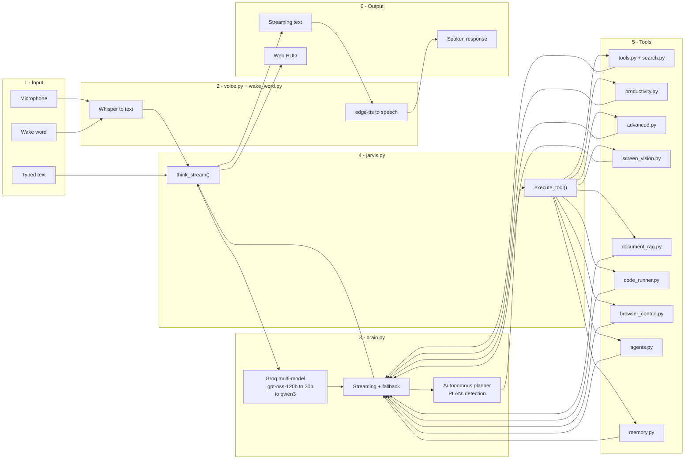

# JARVIS

An autonomous AI assistant with voice I/O, tool calling, code execution, browser automation, and multi-agent orchestration.
Built in Python, JARVIS combines a Groq-powered LLM brain with a rich set of 40+ tools, persistent memory, and a Stark Industries-style web HUD.


---

## Features

### Interfaces
- **Terminal** (`jarvis.py`) - type or speak
- **Web UI** (`app.py`) - Stark Industries-style HUD with an animated arc reactor, live telemetry, streaming transcript, and gold-bordered plan rendering

### Voice I/O
- Speech-to-text via **Whisper** (`base` model), auto language detection (English + Hindi)
- Text-to-speech via **edge-tts** (Microsoft neural voice)
- Hybrid input - type commands or use voice
- Wake word detection (optional) - say **"Hey Jarvis"**

### LLM Brain
- **Groq API** (free tier) with multi-model fallback: `openai/gpt-oss-120b` -> `gpt-oss-20b` -> `qwen/qwen3-32b`
- Streaming responses (token-by-token)
- Autonomous planning - LLM writes a `PLAN:` block for multi-step tasks
- Up to **25 tool calls** per request
- Tool hallucination guard - rejects invalid tool names and retries
- Optional local fallback via **Ollama** when Groq is unavailable

### 40+ Tools Across 11 Categories

| Category | Tools |
|----------|-------|
| Intelligence | Weather, Wikipedia, random Wikipedia, web search, news search |
| Workspace | Send email, open apps (Spotify, Chrome, VS Code, etc.), open websites |
| Productivity | Screenshot, clipboard read/write, file search, notes, timer, reminders |
| System | System info (battery, CPU, RAM), public IP |
| Entertainment | YouTube playback (yt-dlp + mpv), Spotify web player fallback |
| Utility | Calculator, coin flip, dice roll, morning briefing |
| Conversion | Unit conversion (length, weight, temperature), currency (live rates) |
| Language | Translation (30+ languages), PDF text extraction |
| **Code execution** | Sandboxed Python - computes, analyzes CSV/JSON, plots data |
| **Screen vision** | Analyze screen, read screen text, explain screen errors, translate screen |
| **RAG over files** | Index a folder once, then ask questions about your PDFs/notes |
| **Browser automation** | Playwright - open URLs, search Google/YouTube, click, type, scrape |
| **Multi-agent** | Spawn parallel sub-agents (researcher, coder, writer, planner) |

### Long-term Memory
- Persistent **SQLite** store for user facts ("remember X")
- Full conversation history - searchable, queryable by date
- Session memory for "repeat that" / "what did I just ask"
- Slash commands: `/remember`, `/memory`, `/forget`, `/history`, `/stats`

### Slash Commands + Shell Features
- `/w [city]` -> weather | `/s [query]` -> search | `/p [song]` -> play | `/stop` -> stop music
- `/t [text] to [lang]` -> translate | `/wiki [topic]` -> Wikipedia | `/c [expr]` -> calculate
- `/note` | `/remind` | `/screen` | `/read` | `/error` | `/index` | `/ask` | `/clear` | `/help`
- Command history (Up/Down arrow keys)
- Tab completion for common commands

---

## Architecture



The pipeline flows through six stages:

1. **Input** - microphone, typed text, or wake word.
2. **Voice** - Whisper converts speech to text; edge-tts converts text to speech.
3. **Brain** - Groq multi-model LLM handles streaming, fallback, and autonomous planning.
4. **Router** - `think_stream()` and `execute_tool()` in `jarvis.py` orchestrate the flow.
5. **Tools** - nine tool modules covering intelligence, productivity, code execution, vision, RAG, browser automation, multi-agent orchestration, and memory.
6. **Output** - streaming text to the terminal, spoken response via TTS, and the web HUD.

---

## Project Structure

```
jarvis/
├── app.py                 # Flask web server - Stark HUD interface
├── jarvis.py              # Main terminal entry point & router
├── brain.py               # LLM brain: Groq calls, streaming, planning
├── voice.py               # Speech-to-text (Whisper) & text-to-speech (edge-tts)
├── wake_word.py           # Vosk-based wake word detection
├── wake_listener.py       # Wake word listener with browser polling
├── input_handler.py       # Hybrid input handling (typed / voice)
├── tools.py               # Core tool registry & dispatcher
├── search.py              # Web search, news, Wikipedia, weather
├── productivity.py        # Screenshot, clipboard, notes, timer, reminders
├── advanced.py            # Unit conversion, currency, translation, PDF
├── screen_vision.py       # Screen analysis (Qwen vision model)
├── document_rag.py        # RAG over local PDFs / notes
├── code_runner.py         # Sandboxed Python execution
├── browser_control.py     # Playwright browser automation
├── agents.py              # Multi-agent orchestration (researcher, coder, writer, planner)
├── memory.py              # SQLite long-term memory & conversation history
├── slash_commands.py      # Slash command definitions & handling
├── youtube_player.py      # YouTube playback via yt-dlp + mpv
├── claude_tools.py        # Additional Claude-compatible tools
├── templates/             # HTML templates for the web HUD
├── docs/                  # Documentation & screenshots
├── requirements.txt       # Python dependencies
└── README.md
```

---

## Installation

### Prerequisites
- Python 3.10+
- **Groq API key** (free tier available at [console.groq.com](https://console.groq.com))
- Optional: **Ollama** for local LLM fallback
- Optional: **Playwright** browsers for browser automation
- Optional: **Vosk** model for wake word detection

### Steps

1. **Clone the repository**
   ```bash
   git clone https://github.com/Happ3ns/jarvis.git
   cd jarvis
   ```

2. **Create and activate a virtual environment**
   ```bash
   python -m venv venv
   source venv/bin/activate   # Linux / macOS
   venv\Scripts\activate      # Windows
   ```

3. **Install Python dependencies**
   ```bash
   pip install -r requirements.txt
   ```

4. **Install Playwright browsers** (for browser automation)
   ```bash
   playwright install
   ```

5. **Set up environment variables**
   Create a `.env` file in the project root:
   ```env
   GROQ_API_KEY=your_groq_api_key_here
   # Optional
   OLLAMA_BASE_URL=http://localhost:11434
   SPOTIFY_CLIENT_ID=your_spotify_client_id
   SPOTIFY_CLIENT_SECRET=your_spotify_client_secret
   ```

6. **Download the Vosk model** (if using wake word)
   ```bash
   # Example for small English model
   wget https://alphacephei.com/vosk/models/vosk-model-small-en-us-0.15.zip
   unzip vosk-model-small-en-us-0.15.zip -d models/
   ```
   Update the model path in `wake_word.py` if needed.

---

## Usage

### Terminal Mode
```bash
python jarvis.py
```
- Type commands or press **`v`** to speak.
- Say **"Hey Jarvis"** (if wake word enabled) to activate voice input.
- Use slash commands (e.g., `/w London`, `/s Python tutorials`) for quick actions.

### Web HUD
```bash
python app.py
```
Open `http://localhost:5000` in your browser. The HUD provides:
- Animated arc reactor
- Live telemetry (system stats, active tools)
- Streaming transcript of the conversation
- Gold-bordered plan rendering for autonomous tasks

### Example Commands
```
"What's the weather in Tokyo?"
"Search for the latest AI news"
"Play Bohemian Rhapsody on YouTube"
"Translate 'Good morning' to Spanish"
"Take a screenshot and read the text"
"Analyze this CSV file: /path/to/data.csv"
"Remember that my favorite color is blue"
"/index /home/user/documents"
"/ask What are the key points in my notes?"
"Spawn a researcher and a writer to create a report on quantum computing"
```

---

## Memory System

JARVIS stores long-term memory in a local SQLite database (`memory.db`).
- **Facts** - use `/remember` to persist user facts; retrieve with `/memory`.
- **Conversation history** - every session is logged and searchable by date.
- **Session memory** - in-context recall for "repeat that" or "what did I just ask".

Slash commands:
- `/remember <fact>` - store a fact
- `/memory` - list stored facts
- `/forget <fact>` - remove a fact
- `/history` - show recent conversation history
- `/stats` - show memory statistics

---

## Tools Reference

| Module | Description |
|--------|-------------|
| `tools.py` | Central registry and dispatcher for all tools |
| `search.py` | Web search, news, Wikipedia, weather |
| `productivity.py` | Screenshot, clipboard, file search, notes, timer, reminders |
| `advanced.py` | Unit conversion, currency, translation, PDF extraction |
| `screen_vision.py` | Screen analysis using Qwen vision model |
| `document_rag.py` | RAG over local PDFs and notes (index once, ask questions) |
| `code_runner.py` | Sandboxed Python execution (CSV/JSON analysis, plotting) |
| `browser_control.py` | Playwright automation (open URLs, search, click, type, scrape) |
| `agents.py` | Spawn parallel sub-agents: researcher, coder, writer, planner |
| `memory.py` | SQLite long-term memory and conversation history |
| `youtube_player.py` | YouTube playback via yt-dlp + mpv |

---

## Multi-Agent Orchestration

JARVIS can spawn parallel sub-agents to handle complex tasks.
Each sub-agent has a specialised role:
- **Researcher** - gathers information from the web and local files.
- **Coder** - writes and executes code in a sandbox.
- **Writer** - composes reports, summaries, and creative content.
- **Planner** - breaks down large goals into actionable steps.

Example prompt:
> "Spawn a researcher and a writer to create a report on the latest advances in fusion energy."

The main brain coordinates the sub-agents, collects their outputs, and synthesises a final response.

---

## Dependencies

Core dependencies (see `requirements.txt` for the full list):

- `sounddevice`, `numpy` - audio capture
- `openai-whisper` - speech-to-text
- `edge-tts` - text-to-speech
- `ddgs` - web search
- `requests` - HTTP client
- `spotipy` - Spotify integration
- `psutil` - system info
- `flask` - web HUD
- `pyperclip`, `pyautogui` - clipboard and screen automation
- `openai` - Groq API client (OpenAI-compatible)
- `vosk` - wake word detection
- `playwright` - browser automation (install browsers separately)

---

## Contributing

Contributions are welcome!
1. Fork the repository.
2. Create a feature branch (`git checkout -b feature/amazing-feature`).
3. Commit your changes (`git commit -m 'Add amazing feature'`).
4. Push to the branch (`git push origin feature/amazing-feature`).
5. Open a Pull Request.

Please ensure your code follows the existing style and includes relevant tests where applicable.

---

## License

MIT — use, modify, and extend freely.

---

## Acknowledgements

- [Groq](https://groq.com) for fast LLM inference.
- [OpenAI Whisper](https://github.com/openai/whisper) for speech recognition.
- [edge-tts](https://github.com/rany2/edge-tts) for neural text-to-speech.
- [Playwright](https://playwright.dev) for browser automation.
- [Vosk](https://alphacephei.com/vosk/) for offline wake word detection.
- The open-source community for the many libraries that make JARVIS possible.

---

*"Sometimes you gotta run before you can walk." - Tony Stark*
