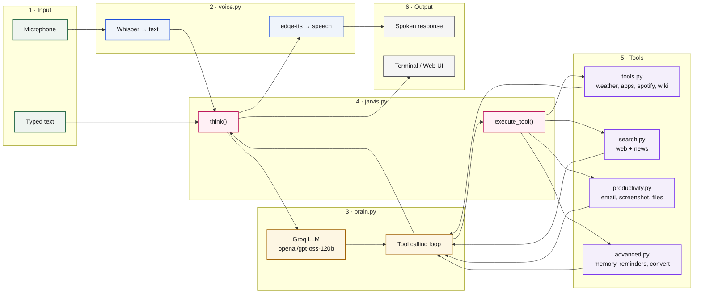

# JARVIS

A voice assistant in Python. Listens through your mic, transcribes with Whisper, routes intent through an LLM, executes tools, and speaks back.


## Features

**Interfaces:**
- Terminal (`jarvis.py`) — type or speak
- Web UI (`app.py`) — Stark Industries–style HUD with an animated arc reactor, live telemetry, and chat transcript

**Voice I/O:**
- Speech-to-text via Whisper (`base` model)
- Text-to-speech via edge-tts (neural voice)
- Hybrid input — type commands or use voice

**LLM brain:**
- Groq API (free tier) running `openai/gpt-oss-120b`
- Tool calling — the LLM decides which tool to use
- Conversation memory — recalls recent exchanges

**20+ tools across 8 categories:**

| Category | Tools |
|---|---|
| Intelligence | Weather, Wikipedia, random Wikipedia, web search, news search |
| Workspace | Send email, open apps (Spotify, Chrome, VS Code, etc.), open websites |
| Productivity | Screenshot, clipboard read/write, file search, notes, timer, reminders |
| System | System info (battery, CPU, RAM), public IP |
| Entertainment | Spotify playback (search + play) |
| Utility | Calculator, coin flip, dice roll, morning briefing |
| Conversion | Unit conversion (length, weight, temperature), currency (live rates) |
| Language | Translation (30+ languages), PDF text extraction |

## Architecture



## Project structure

```
jarvis/
├── jarvis.py           # Entry point — main loop + think() + execute_tool()
├── app.py              # Flask server for the web UI
├── brain.py            # Groq LLM integration + tool-calling loop
├── claude_tools.py     # Tool schemas in OpenAI function-calling format
├── voice.py            # Whisper (input) + edge-tts (output)
├── input_handler.py    # Parallel typed/voice input threads
├── tools.py            # Core tools: weather, apps, spotify, wiki, calc
├── search.py           # Web search + news (DuckDuckGo)
├── productivity.py     # Email, screenshot, clipboard, file search
├── advanced.py         # Memory, reminders, conversions, translation, PDF
├── templates/
│   └── index.html      # Stark Industries HUD web interface
├── requirements.txt
└── README.md
```

## Setup

### 1. Install dependencies

```bash
pip install -r requirements.txt
```

### 2. Install ffmpeg (Windows)

Required for Whisper audio loading:

```powershell
winget install ffmpeg
```

### 3. Get a free Groq API key

1. Sign up at [console.groq.com](https://console.groq.com)
2. Create an API key at [console.groq.com/keys](https://console.groq.com/keys)
3. The key starts with `gsk_` — copy it whole

### 4. Set environment variables

**In `~/.bashrc` (Git Bash):**

```bash
echo 'export GROQ_API_KEY="gsk_your_key_here"' >> ~/.bashrc
source ~/.bashrc
```

**Verify:**

```bash
echo $GROQ_API_KEY
```

Should print your key. If it prints empty, close and reopen Git Bash.

### 5. Optional — Gmail for email tool

1. Enable 2-Step Verification on your Google account
2. Generate an App Password at [myaccount.google.com/apppasswords](https://myaccount.google.com/apppasswords)
3. Add to `.bashrc`:

```bash
echo 'export JARVIS_EMAIL="your-email@gmail.com"' >> ~/.bashrc
echo 'export JARVIS_EMAIL_PASS="your-16-char-app-password"' >> ~/.bashrc
source ~/.bashrc
```

### 6. Optional — Spotify for playback

1. Create a Spotify Developer app at [developer.spotify.com/dashboard](https://developer.spotify.com/dashboard)
2. Add redirect URI: `http://127.0.0.1:8888/callback`
3. Add to `.bashrc`:

```bash
echo 'export SPOTIFY_CLIENT_ID="your-client-id"' >> ~/.bashrc
echo 'export SPOTIFY_CLIENT_SECRET="your-client-secret"' >> ~/.bashrc
source ~/.bashrc
```

Requires Spotify Premium for playback control.

## Running

### Terminal version

```bash
python jarvis.py
```

Type a message and press Enter, or type `voice` to record from the mic.

### Web version

```bash
python app.py
```

Open [http://127.0.0.1:5000](http://127.0.0.1:5000) in your browser.

The web UI shows a Stark Industries HUD with:
- **Animated arc reactor** that changes colour based on state (cyan → green → yellow → pink)
- **Live telemetry** — clock, uptime, CPU/memory load
- **Transmission log** — chat transcript
- **Activity feed** — recent commands
- **Command reference** — grouped list of directives

## Usage examples

### Conversation (LLM routes to the right tool)

```
> what's the weather in Delhi
JARVIS: Delhi is 28.4°C with wind at 12 km/h.

> could you tell me the weather in Delhi please
JARVIS: Delhi is 28.4°C with wind at 12 km/h.

> put on some music by Arijit Singh
JARVIS: Playing Tum Hi Ho by Arijit Singh.

> remind me to eat in 2 minutes
JARVIS: Reminder set for 2 minutes from now.
```

### Direct tool commands

| Command | Tool used |
|---|---|
| `search for best coffee in Kanpur` | Web search |
| `latest news about ISRO` | News search |
| `who is Alan Turing` | Wikipedia |
| `what's 15 times 47` | Calculator |
| `convert 10 km to miles` | Unit conversion |
| `100 USD to INR` | Currency conversion |
| `translate good morning to Japanese` | Translation |
| `take a screenshot` | Screenshot |
| `read my clipboard` | Clipboard |
| `find file resume` | File search |
| `morning briefing` | Date + time + weather + battery |
| `what did I just ask` | Conversation memory |

### Email

```
> send email to friend@example.com about project update saying I finished the ML pipeline
JARVIS: Email sent to friend@example.com.
```

## Why an LLM brain

Before the LLM, routing was keyword matching:

```python
if "weather" in text:
    return get_weather(...)
if text.startswith("play "):
    return play_on_spotify(...)
```

This meant every phrasing needed its own pattern. `play company` worked; `could you play company` didn't.

With the LLM, tools are declared once as JSON schemas, and the model decides which to call based on intent:

```python
response = client.chat.completions.create(
    model="openai/gpt-oss-120b",
    messages=messages,
    tools=TOOLS,  # 20+ tool schemas
)
```

Any natural phrasing works. Adding a new tool is one entry in `claude_tools.py` — not a new `if` branch.

## Cost

Groq's free tier provides ~14,400 requests per day. For personal use, that's more than enough — you'll hit the daily limit only if you're issuing hundreds of commands an hour.

## Web UI screenshots

The HUD interface shows the arc reactor at centre, flanked by telemetry panels:

| State | Colour |
|---|---|
| Idle | Cyan |
| Listening | Green |
| Thinking | Yellow |
| Speaking | Pink |
| Error | Red |

## Future work

- **Wake word detection** — say "JARVIS" to activate without typing (blocked by Picovoice's business-email requirement)
- **Google Calendar integration** — read and create events via the Google Calendar API
- **Multi-turn context window** — persist conversation across sessions in a JSON file
- **Voice activity detection** — record until silence instead of fixed 5 seconds
- **Local model fallback** — use Ollama when the network is down
- **Mobile companion** — React Native app or PWA version of the HUD

## Technical notes

**Why Groq instead of OpenAI or Anthropic?**
Groq's free tier is genuinely usable (14,400 requests/day), it's extremely fast, and its API is OpenAI-compatible. The code uses the standard `openai` Python library pointed at Groq's endpoint — switching providers later is a one-line change.

**Why edge-tts instead of pyttsx3?**
`pyttsx3` uses Windows SAPI voices, which sound robotic. `edge-tts` uses Microsoft's neural voices — the same ones behind Cortana and Edge's Read Aloud — and sounds dramatically more natural. Both are free.

**Why Whisper `base`?**
`tiny` is too inaccurate; `small` is 3× slower with marginal gains for short commands. `base` hits the sweet spot at 74M parameters, running in ~1 second on CPU for a 5-second clip.

**Why split into modules?**
`jarvis.py` (routing), `brain.py` (LLM), `voice.py` (audio I/O), `tools.py` (utilities), `app.py` (web server). Each has one job. The split makes the project easy to extend — adding a new tool touches two files, not one 500-line script.

## License

MIT

## Built with

Python · OpenAI SDK · Groq · Whisper · edge-tts · Flask · Mermaid
